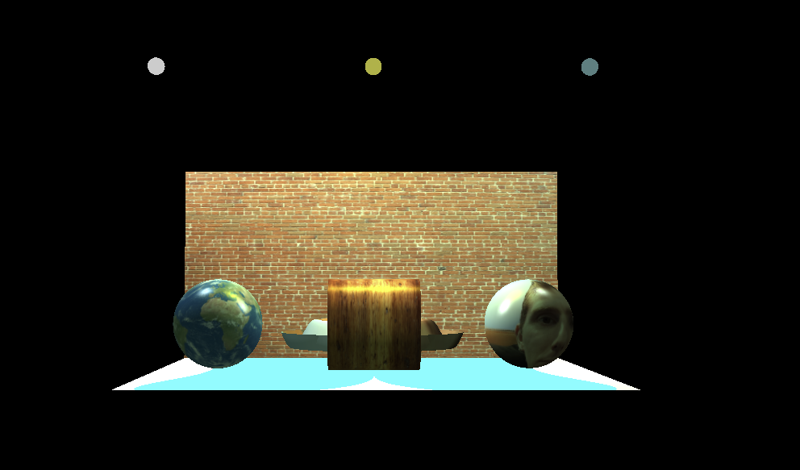
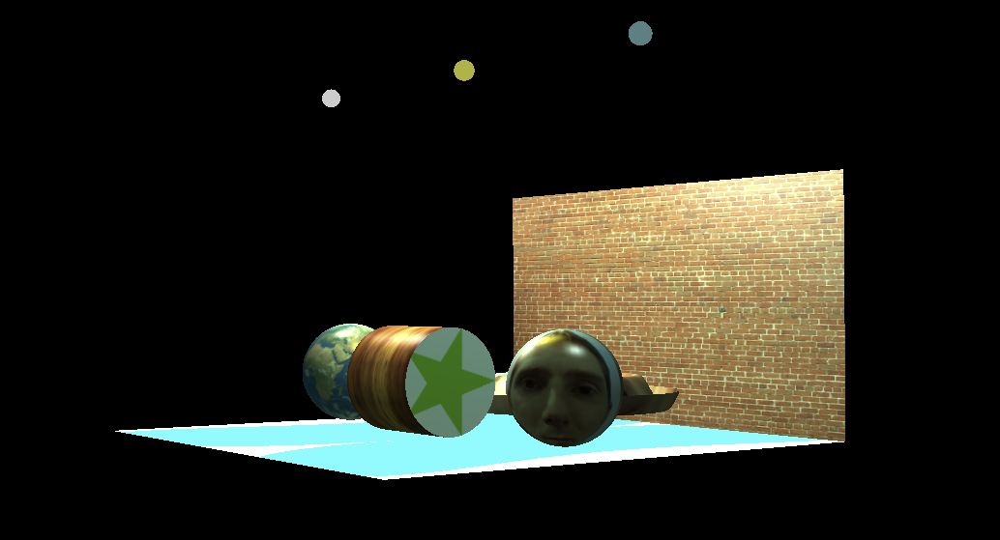
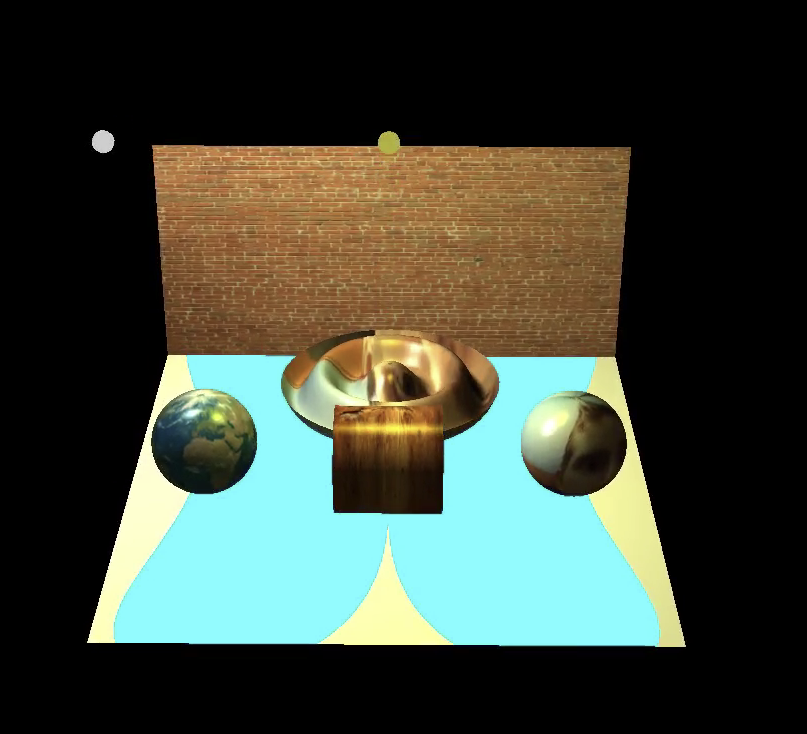

# 3D Graphics Renderer with OpenGL

This project is an interactive 3D graphics renderer implemented using OpenGL. It demonstrates various computer graphics concepts including Phong lighting, texture mapping, and geometric primitives manipulation.

## Features

- **Advanced Lighting**: Implementation of Phong lighting model with multiple light sources
- **Texture Mapping**: Support for both bitmap and procedural textures
- **3D Geometries**: Includes spheres, cylinders, and tori with adjustable mesh resolution
- **Interactive Controls**: Camera movement and object manipulation
- **Animation Support**: Built-in animation system with controllable timing

## Project Structure

```
.
├── src/
│   ├── core/           # Core rendering and math functionality
│   ├── geometry/       # 3D geometric primitives
│   ├── shaders/        # GLSL shader programs
│   └── utils/          # Utility functions and helpers
├── assets/
│   └── images/         # Texture images and resources
└── docs/              # Documentation
```

## Screenshots





## Controls

- **Arrow Keys**: Control view direction
- **Home/End**: Move closer/farther from the scene
- **1-4 Keys**: Toggle individual lights
- **R Key**: Toggle animation
- **W Key**: Toggle wireframe mode
- **ESC**: Exit application

## Dependencies

- OpenGL
- GLEW
- GLFW3
- GLU

## Technical Details

### Lighting System

The project implements the Phong lighting model with support for:

- Multiple light sources
- Ambient, diffuse, and specular components
- Light attenuation

### Shader Programs

Two main shader programs are implemented:

1. Bitmap texture mapping shader
2. Procedural texture mapping shader

### Geometry System

The project includes a flexible geometry system with:

- Customizable mesh resolution
- Support for various 3D primitives
- Wireframe rendering mode
